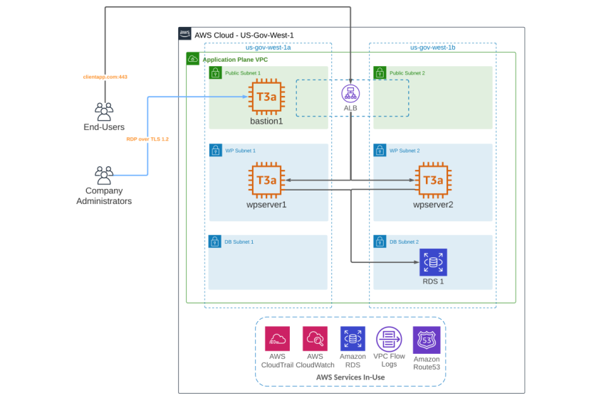

# Deploying a WebServer on AWS

This project focuses on deploying coalfire first draft infrastructure on AWS provisioned through terraform. The architecture designed and executed is given below

This infra consists of a standalone networking, compute & storage stack including which are as follows:

- **Networking:**  VPC, Public & Private Subnets, IGW, NGW, ALB, Route Tables & Associations
- **Compute:**  EC2, Redis
- **Storage:** RDS

## Accessing the application

You will hit the load balancer to view the app running on it. 

## Deploying a fresh Terraform script on AWS

Follow the steps given below to deploy a fresh end to end infra provisioned by terraform 

## Terraform Initialization
Open the Terraform Main Folder in the VSCode and in the root directory [ which
contains other directories like modules, template etc. ] ,

type the command given below for terraform initialization:

- terraform init

## Terraform Apply
Once terraform is initialized, run the command below to see which resources would get
deployed if terraform script runs successfully:

- terraform plan

The variable configuratiom files is **terraform.auto.tfvars** and you can change the attribute 
paramaters value over there of your own choice.  

To deploy infrastructure, run the command below in in root folder

- terraform apply

**NOTE**: Remember to run above command in /root-directory folder , Else it will give
ERROR due to File Location Issue.

After the command starts to run, terraform will show resources being created and will
ask permission from you to build up resources.

Type -- **yes** -- and AWS infrastructure will start to build up and get deployed.

## Terraform Destroy
If you want to destroy the terraform, type the command below:

- terraform destroy

On running this, terraform will show resources being destroyed and will
ask permission from you to clean up resources.

Type -- **yes** -- and AWS infrastructure will start to clean up and resources will be destroyed.

## SSH into an EC2 Instance

- Locate the already created wpserver-ohio-keypair present in your terraform code repository
- Go to the EC2 console in AWS
- Click and open the window's bastion instance
- Click on the connect option
- Go to the **connect using RDP** option 
- Follow the steps given like changing the key permission 
- From here, SSH to the redhat instance using SSH tools like **Putty**
- Do ssh and type yes when you hit the command and you will be inside the instance

<!-- BEGIN_TF_DOCS -->
## Requirements

| Name | Version |
|------|---------|
|  [terraform](#requirement\_terraform) | >= 0.15 |
|  [aws](#requirement\_aws) | >= 4.19.0 |

## Providers

No providers.

## Modules

| Name | Source | Version |
|------|--------|---------|
|  [alb](#module\_alb) | ./modules/alb | n/a |
|  [bastion\_instance\_1](#module\_bastion\_instance\_1) | ./modules/ec2 | n/a |
|  [rds](#module\_rds) | ./modules/rds | n/a |
|  [security\_group](#module\_security\_group) | ./modules/securitygp | n/a |
|  [vpc](#module\_vpc) | ./modules/vpc | n/a |
|  [wpserver\_ec2\_1](#module\_wpserver\_ec2\_1) | ./modules/ec2 | n/a |
|  [wpserver\_ec2\_2](#module\_wpserver\_ec2\_2) | ./modules/ec2 | n/a |

## Resources

No resources.

## Inputs

| Name | Description | Type | Default | Required |
|------|-------------|------|---------|:--------:|
|  [aws\_region](#input\_aws\_region) | n/a | `any` | n/a | yes |
|  [db\_instance\_password](#input\_db\_instance\_password) | n/a | `string` | `"gencoderstagedb"` | no |
|  [ec2\_instance\_type](#input\_ec2\_instance\_type) | n/a | `any` | n/a | yes |
|  [vpc](#input\_vpc) | n/a | `any` | n/a | yes |

## Outputs

No outputs.
<!-- END_TF_DOCS -->